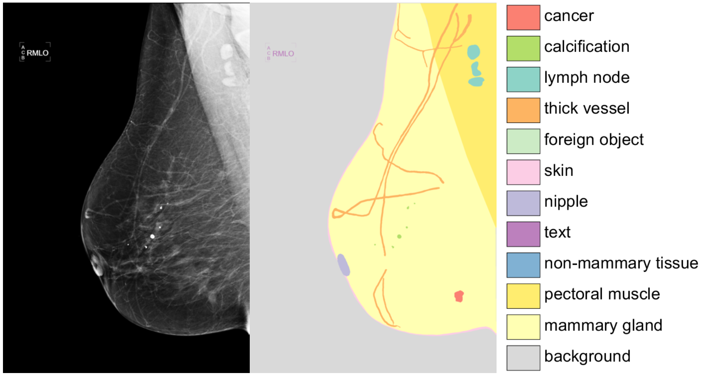

# CSAW-S: mammography screenings from 172 different patients with annotations for semantic segmentation

## To download the dataset follow this [link](https://zenodo.org/record/4030660#.X2HD15MzZhE)

If you use this dataset please cite our work [Adding seemingly uninformative labels helps in low data regimes](https://proceedings.icml.cc/static/paper_files/icml/2020/2797-Paper.pdf)


<p align="center">
  
</p>


### Reproducibility
**To convert the dataset to the version we used for our [experiments](https://github.com/ChrisMats/seemingly_uninformative_labels) open the csaws_creation folder and run the script generate_dataset.py**

### Enviroment setup
To install the enviroment we use run:
```conda env create -f environment.yml```

## Data structure
```
current folder 
│ 
├── CsawS 
│     │
│     ├ anonymized_dataset -> patient folders with all the screenings and annotations (tumors - expert 1)
│     │
│     ├ test_data
│     │     │
│     │     ├ anonymized_dataset -> patient folders with all the screenings
│     │     │
│     │     ├ annotator_1 -> annotations from expert 1
│     │     │
│     │     ├ annotator_2 -> annotations from expert 2
│     │     │
│     │     └ annotator_3 -> annotations from expert 3
│     │
│     └ training_random_splits.json -> the splits we used for our experiments (can be ommited)
│ 
├── csaws_creation -> scripts to convert the dataset to the version we used for our experiments
│ 
└── README.md -> current file
```
